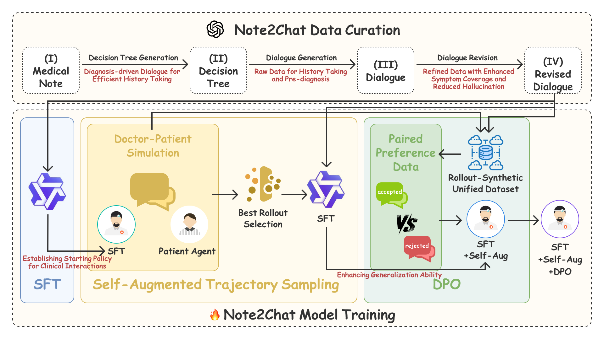

<div align="center">

<h1>Note2Chat: Improving LLMs for Multi-Turn Clinical History Taking Using Medical Notes</h1>
</div>

## Abstract
Effective clinical history taking is a foundational yet underexplored component of clinical reasoning. While large language models (LLMs) have shown promise on static benchmarks, they often fall short in dynamic, multi-turn diagnostic settings that require iterative questioning and hypothesis refinement. To address this gap, we propose Note2Chat, a note-driven framework that trains LLMs to conduct structured history taking and diagnosis by learning from widely available medical notes. Instead of relying on scarce and sensitive dialogue data, we convert real-world medical notes into high-quality doctor-patient dialogues using a decision tree-guided generation and refinement pipeline. We then propose a three-stage fine-tuning strategy combining supervised learning, simulated data augmentation, and preference learning. Furthermore, we propose a novel single-turn reasoning paradigm that reframes history taking as a sequence of single-turn reasoning problems. This design enhances interpretability and enables local supervision, dynamic adaptation, and greater sample efficiency. Experimental results show that our method substantially improves clinical reasoning, achieving gains of +16.9 F1 and +21.0 Top-1 diagnostic accuracy over GPT-4o. Our code and dataset can be found at https://github.com/zhentingsheng/Note2Chat.

## Method


## Setup

To set up your environment and run Note2Chat, follow these steps:

### 1. Clone the Repository
```bash
git clone https://github.com/zhentingsheng/Note2Chat.git
```

### 2. Setup the environment

ENV 1: Inference environment (vllm)
```bash
conda create -n vllm python=3.10 -y
conda activate vllm

pip install -r requirements.txt

export OPENAI_API_KEY="your_api_key_here"

conda deactivate
```

ENV 2: DPO training environment (dpo)
```bash
conda create -n dpo python=3.10 -y
conda activate dpo

pip install -r requirements-dpo.txt

conda deactivate
```

### 3. Setup llama-factory
```bash
git clone https://github.com/hiyouga/llama-factory.git
cd llama-factory
```
Set up the environment for llama-factory.


### 4. Download the neccessary models

- [Qwen2.5-7B-Instruct](https://huggingface.co/Qwen/Qwen2.5-7B-Instruct/tree/main)
- [Qwen2.5-32B-Instruct-GPTQ-Int8](https://huggingface.co/Qwen/Qwen2.5-32B-Instruct-GPTQ-Int8/tree/main)

### 5. Data Acquisition

#### Data Source
Obtain clinical case data from the [PhysioNet MIMIC-IV](https://physioNet.org/content/mimiciv/3.1/) database.

#### Data Files
The following note ID files are provided in the `data/note_ids/` directory:
- `trainset_note_ids.csv` - List of note IDs for the training set
- `testset_note_ids.csv` - List of note IDs for the test set

#### Required Clinical Fields
Using the provided note IDs, extract the following key clinical information from the MIMIC-IV database:
- **Chief Complaint** - The patient's primary reason for seeking medical care
- **History of Present Illness** - Detailed chronology of the current medical condition
- **Final Diagnosis** - The physician's conclusive diagnosis

#### Extraction Procedure
1. Access the [MIMIC-IV database](https://physioNet.org/content/mimiciv/3.1/)
2. Complete required certification and data use agreement registration
3. Query discharge summary records using the provided note ID lists
4. Parse and extract the three specified clinical fields from the retrieved records
5. Save the extracted data to data/notes/ directory with the following CSV files:
- `notes.csv` - Training set and Test set clinical notes

    **CSV Schema:**
    `notes.csv` contains the following columns:
    - `note_id` - Unique identifier for each clinical note
    - `chief_complaint` - Extracted chief complaint section
    - `history_of_present_illness` - Extracted history of present illness section
    - `final_diagnosis` - Extracted final diagnosis section

    **File Structure:**
    ```
    data/
    ├── note_ids/
    │   ├── trainset_note_ids.csv
    │   └── testset_note_ids.csv
    └── notes/
        └── notes.csv
    ```


## Experiment Scripts

Once your environment is set up, you can run the experiments:

### 0. Data Preprocessing

```bash
bash scripts/preprocessing.sh
```

### 1. Note2Chat Data Curation - Decision Tree-Guided Generation and Refinement Pipeline

```bash
bash scripts/dialogue_synthesis.sh
```

### 2. Note2Chat Model Training - Three-stage Fine-tuning Strategy

#### 2.1 Multi-turn

##### SFT
```bash
bash sft/multi_turn_sft_gpt.sh
```
##### Self-Augmented Trajectory Sampling
```bash
bash scripts/multi_turn_sampling.sh
bash sft/multi_turn_sft_gpt_sampling.sh
```
##### DPO

```bash
conda activate dpo
bash dpo/run_multi_turn.sh
```

#### 2.2 Single-turn
##### sft
```bash
bash sft/single_turn_sft_gpt.sh
```
##### self-augmented trajectory sampling
```bash
bash sft/multi_turn_sft_gpt_sampling.sh
```
##### dpo

```bash
conda activate dpo
bash dpo/run_multi_turn.sh
```

### 3. Run Evaluation

```bash
conda activate vllm

python3 src/pipelines/zeroshot_experiments.py
python3 src/pipelines/history_taking.py
python3 src/pipelines/single_turn_ablation.py
```